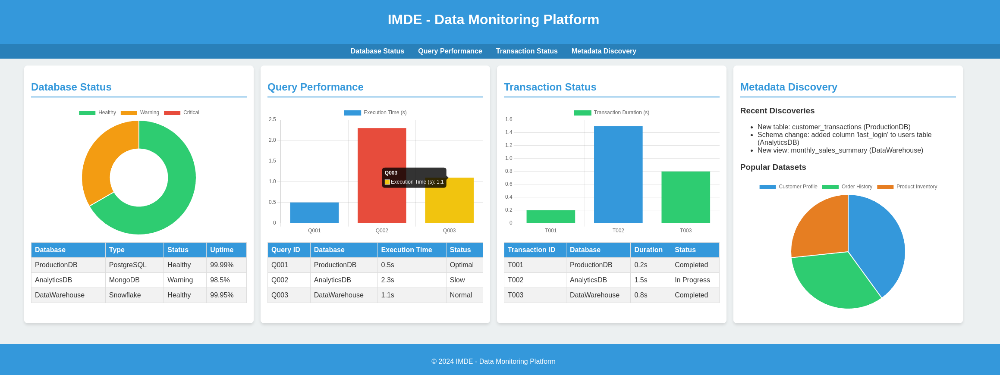

# IMDE (I AM a Data Engineer)

# 1. Initial Concept

- In-house data end to end monitoring platform based on RBAC

- It should check DB status including DW (On-premise, Cloud, Solutions), transaction status, query performance, datapipeline.

- It has to contain a service like datahub

# 2. Architecture

- It can be changed.

# 3. Concept Image

